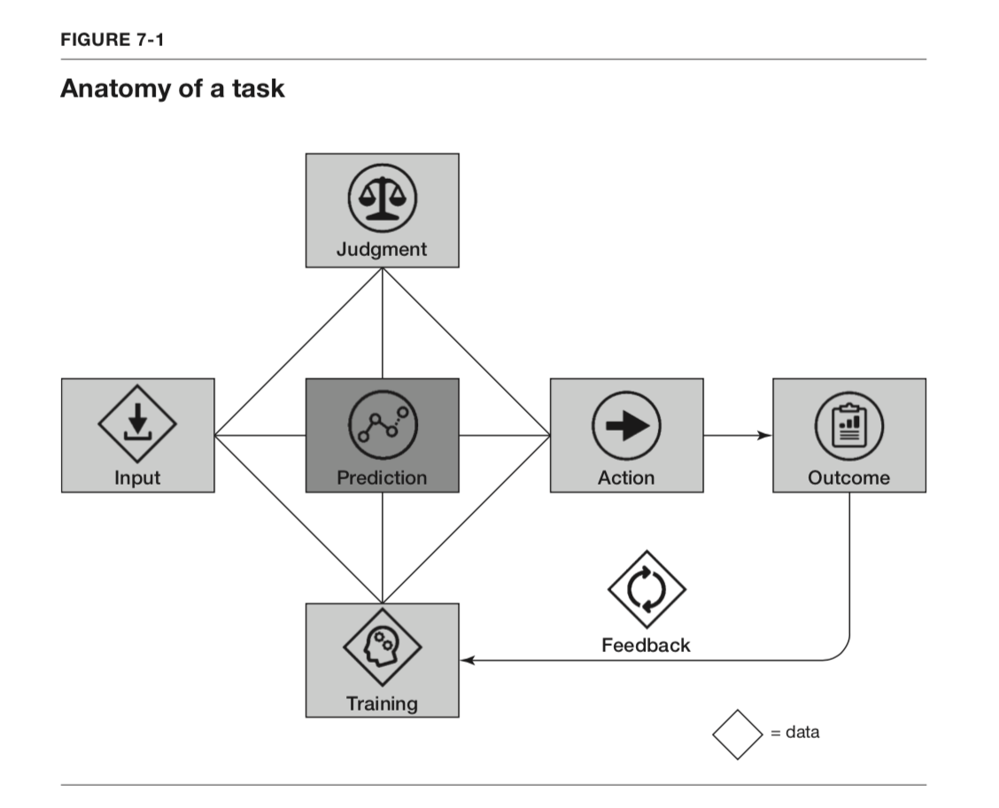

# Final Project

## Objectives

- Demonstrate knowledge of how **prediction** and **judgement** together contribute to a decision and action, as presented in *Prediction Machines.*
- Employ quantization to reduce model size and improve performance on an edge device.
- Demonstrate knwoledge of dependency management while deploying a model.

**Every** project must:

1. Use some form of quantization. If quantization is built-in, determine what type it is and where it is built in.
2. Be pushed to a public GitHub repository
3. Include either a `Dockerfile` (if deploying with containerization),
    or a `requirements.txt` if deploying with a Python virtual environment,
    or a Jupyter Notebook that outputs the byte model for TF Lite Micro on Arduino.
4. Include a README that describes how to deploy and use the program and model.

## Grading

This final project is deliberately open ended, so invites the chance of failure!

**No, wait!** Instead we will have checkpoints with deliverables designed to help you win.

Each checkpoint will be submitted on Gradescope.

### Project Plan

1. Identify what problem you are trying to solve.
2. Discuss the problem in the context of prediction, judgement, and decision.
3. Elaborate on the steps of the engineering method/ ML Workflow that you will take to reach your goal.
4. Identify a class of models that you think will be helpful in achieving your end state.

### Datasets and Models

You must do one of the following

- Use transfer learning **or**
- Compare performance of several pre-canned models **or**
- Use advanced quantization

1. If you will be conducting transfer learning, identify a dataset that fits your needs.
2. Identify at least one, but ideally multiple, base models that you will use.

### Model Implementation

Get the model working!

### Model Application

Wrap your working model with some logic that makes the results of the prediction available to the user.
This should work towards the goal you described in the first checkpoint.

### Final Demonstration

- Demonstrate your application to the class
- Push code to GitHub

