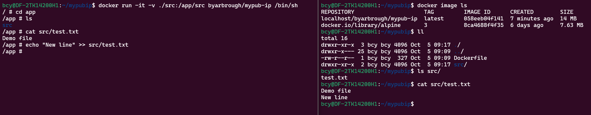

# Containers Part 2

## Developing in a container

### Manually

1. Mount the container as a volume with `-v`
2. Prototype
3. Iterate on the Dockerfile

### VS Code Remote

[Developing inside a container](https://code.visualstudio.com/docs/devcontainers/containers)

## Mini lab

1. See the **mypub-ip** demo
2. Bring the [TF speedup on GPU vs CPU script](https://usafa-ece.github.io/ai-hardware/prediction/hello-colab.html#tensorflow-speedup-on-gpu-relative-to-cpu) into a L4T tensorflow container
3. Build the image
4. Run the image
5. *Optionally**, push the image

### Helpful commands

- [WORKDIR](https://docs.docker.com/engine/reference/builder/#workdir) for setting working directory
- [ADD](https://docs.docker.com/engine/reference/builder/#add) for bringing in the file
