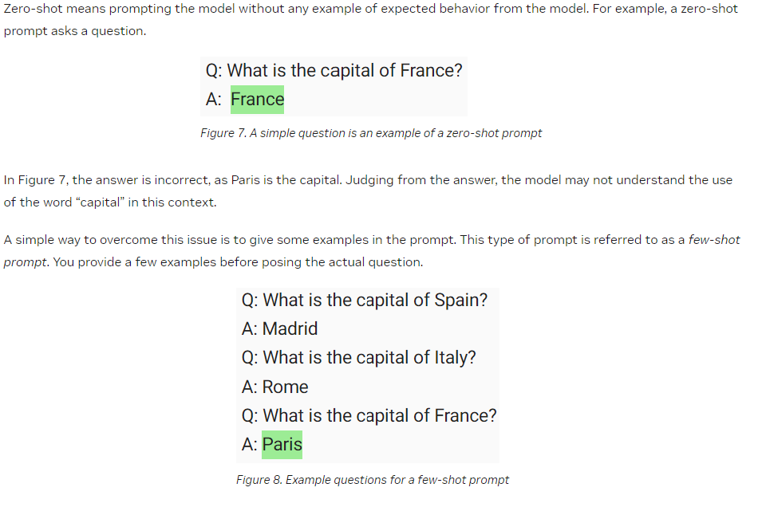

# Large Language Models

## Pre-Reading

- [Best practices for prompt engineering with OpenAI API](https://help.openai.com/en/articles/6654000-best-practices-for-prompt-engineering-with-openai-api)
- [Falcon-RefineWeb Model Card](https://huggingface.co/datasets/tiiuae/falcon-refinedweb)

### Objectives

- Describe how LLMs exhibit emergent behavior
- Employ simple prompt engineering tactics to produce better LLM results.
- Explain hardware limits and challenges with LLMs.

## Emergence

This is one of my all time favorite books.

> **Emergence** is the the opposite of reduction. The latter tries to move from the whole to the parts. It has been enormously successful. The former tries to generate the properties of the whole from an understanding of the parts. Both approaches can he mutually self-consistent.

**Emergence** is when you combine relatively simple sets of rules and at some threshold a mind-blowing result manifests.

$$
sand + glass funnel = ?
$$

$$
sand + glass funnel = time keeping
$$

### The Mind as an Emergent Phenomena

> **There are a wide variety of understandings of what is meant by mind.** The reductionist behaviorist tradition would argue that mind is an epiphenomenon of the activities of collections of neurons. They argue that minds do not in fact exist. At the opposite extreme, the idealist tradition going back to George Berkeley would argue that mind is all that exists, and matter is an epiphenomenon posited by minds for explanatory purposes. The Kantians would argue for the existence of both mind and matter, the latter being the ding an sich (thing in itself) that minds aspire to and cannot fully comprehend.
>
> **Our view is that all of the above is too simplistic.** The universe, whatever its ultimate character, unfolds in a large number of emergences, all of which must he considered. **The pruning rules of the emergences may go beyond the purely dynamic and exhibit a noetic character. It ultimately evolves into the mind, not as something that suddenly appears, but as a maturing character of an aging universe.** This is something that we are just beginning to understand and, frustrating as it may be to admit such a degree of ignorance, we move ahead. **That is our task as humans; some would call it knowing the mind of God and regard it as a vocation.**
> ~ [*The Emergence of Everything*, Harold J. Morowitz](https://www.goodreads.com/book/show/2301.The_Emergence_of_Everything)

### LLMs and Emergence

#### A Socratic Journey to understanding Emergence in Large Language Models*

**Q.** What is the core of Natural Language Processing?
**A.** Doing math with words.

**Q.** What is the key outcome of that math?
**A.** Determining the relationship of words and how they are interconnected in context.

**Q.** How does understanding the relationship between words enable prediction?
**A.** The system can predict the next word or phrase in a sequence.

**Q.** What happens when you scale the ability to predict the next word to billions of parameters?
**A.** The shocking behavior of an LLM *emerges*: the ability to understand context, create coherent paragraphs, exhibit creativity.

## Hardware Expenses

LLMs take **a lot of RAM**.

[Table: 8-bit quantized LLaMA requirements](https://aituts.com/local-llms/)

|   Model   | VRAM Used | Minimum Total VRAM |     Card examples     | RAM/Swap to Load* |
|:---------:|:---------:|:------------------:|:---------------------:|:-----------------:|
| LLaMA-7B  | 9.2GB     | 10GB               | 3060 12GB, 3080 10GB  | 24 GB             |
| LLaMA-13B | 16.3GB    | 20GB               | 3090, 3090 Ti, 4090   | 32 GB             |
| LLaMA-30B | 36GB      | 40GB               | A6000 48GB, A100 40GB | 64 GB             |
| LLaMA-65B | 74GB      | 80GB               | A100 80GB             | 128 GB            |

### Advanced Quantization

[Hugging Face Bits and Bytes](https://huggingface.co/blog/4bit-transformers-bitsandbytes) can make these models much smaller.

### Cost Containment for Generative AI

From DeepLearning AI's [*The Batch* newsletter](https://info.deeplearning.ai/ai-for-brain-surgery-microsofts-chatgpt-bill-googles-generative-phones-better-prompts)

> Microsoft is looking to control the expense of its reliance on OpenAI’s models.
>
> **What’s new:** Microsoft seeks to build leaner language models that perform nearly as well as ChatGPT but cost less to run, The Information reported.
>
> **How it works:** Microsoft offers a line of AI-powered tools that complement the company’s flagship products including Windows, Microsoft 365, and GitHub. Known as Copilot, the line is based on OpenAI models. Serving those models to 1 billion-plus users could amount to an enormous expense, and it occupies processing power that would be useful elsewhere. To manage the cost, Microsoft’s developers are using knowledge distillation, in which a smaller model is trained to mimic the output of a larger one, as well as other techniques.

## Prompt Engineering

Pulled from [NVIDIA -- An Introduction to LLM: Prompt Engineering and P-Tuning](https://developer.nvidia.com/blog/an-introduction-to-large-language-models-prompt-engineering-and-p-tuning/)

### Zero-shot vs. few-shot

Now time for a live demo!
