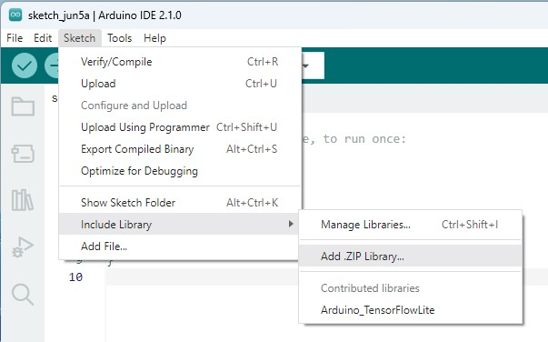

# Wake Word Detection

## Pre-Reading

*TinyML* [Chapter 7](https://learning.oreilly.com/library/view/tinyml/9781492052036/ch07.html#:-:text=Chapter%207.%20Wake-Word%20Detection%3A%20Building%20an%20Application)

- Everything from the start up to the paragraph "There are many more tests in the example, but exploring these few will give us an understanding of the key moving parts."
- Subsection [How the feature provider converts audio to a spectrogram](https://learning.oreilly.com/library/view/tinyml/9781492052036/ch07.html#:-:text=How%20the%20feature%20provider%20converts%20audio%20to%20a%20spectrogram)
- Subsection [The Command Recognizer](https://learning.oreilly.com/library/view/tinyml/9781492052036/ch07.html#:-:text=The%20Command%20Recognizer) up to the code blocks

### Objectives

- Understand how spectral samples can be processed for ML
- Deploy a pre-trained model to TFLite Micro on Arduino

## Lab

### Setup Arduino

Open Arduino IDE.

Navigate to [tensorflow/tflite-micro-arduino-examples (github.com)](https://github.com/tensorflow/tflite-micro-arduino-examples)
and download the repository as a zipfile.

Add the examples zipfile to Arduino IDE libraries via **Sketch > Include Library > Add .ZIP Library**

Plug in your Nano 33 BLE Sense to your laptop using a micro USB cable.

### Run Example

See *TinyML* Chapter 7: [Arduino](https://learning.oreilly.com/library/view/tinyml/9781492052036/ch07.html#:-:text=Arduino) for more detail.

- Open the **micro_speech** example from the newly added library.
- Peruse the code files to get an idea of what you are about to run.
- Select Nano 33 BLE Sense device
- Select COM port
- Upload the code

Compiling will take a while. After uploading, a verbal "Yes" should give you a green light.
A verbal "No" will give you a red light. Any other word will be blue.
